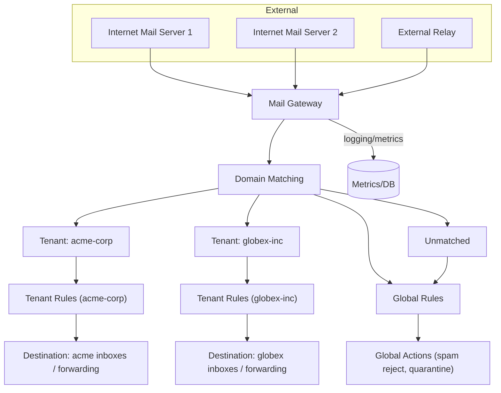
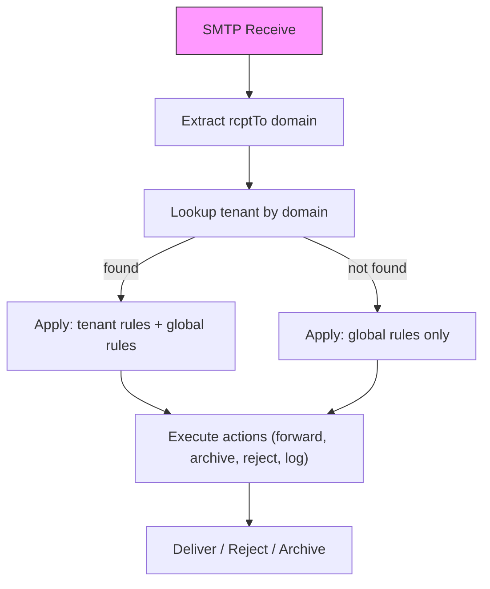

# 멀티 테넌트 SaaS 메일 격리

## 개요

이 사용 사례는 하나의 SaaS 플랫폼이 여러 고객 조직(테넌트)을 호스팅하는 상황을 다룹니다. 각 테넌트는 자체 도메인을 등록합니다. 수신되는 메일은 rcptTo에 있는 도메인으로 식별되어 해당 도메인에 매핑된 테넌트를 찾아 처리합니다. 각 테넌트는 독립적인 분류 룰을 가질 수 있으며, 전체 플랫폼에 적용되는 글로벌 룰도 함께 존재합니다.

요약 흐름:
- 수신 SMTP 연결에서 rcptTo 도메인을 추출
- tenantRepository.findByDomain로 테넌트 조회
- 테넌트가 존재하면, 테넌트 전용 룰과 글로벌 룰을 결합해 우선순위(높은 값 우선)에 따라 평가
- 테넌트가 없거나 비활성화된 경우, 글로벌 룰만 적용

## 아키텍처



설명: 외부 메일 소스는 Mail Gateway로 들어옵니다. Mail Gateway는 rcptTo 도메인을 추출하고 도메인 매칭을 통해 테넌트를 찾습니다. 테넌트별 룰과 글로벌 룰을 결합해 최종 액션을 결정하고, 각 테넌트의 목적지로 라우팅합니다.

## 테넌트 격리 흐름



설명: SMTP가 수신되면 첫 단계에서 rcptTo 도메인을 추출합니다. 그 도메인으로 tenantRepository.findByDomain을 호출해 테넌트를 조회합니다. 테넌트가 있으면 테넌트 룰과 글로벌 룰을 우선순위(높은 값 우선)에 따라 함께 평가해 액션을 실행합니다. 테넌트가 없으면 글로벌 룰만 적용됩니다.

## 환경변수 설정

다음은 .env 예시입니다. 테넌트 구성 자체는 API 또는 CLI로 관리되므로 도메인 같은 항목은 환경변수가 아니라 테넌트 데이터에 저장됩니다.

```
# 데이터베이스 (SQLite 기본)
DATABASE_URL=file:./data/mail-gateway.db

# SMTP 수신 설정
SMTP_HOST=0.0.0.0
SMTP_PORT=2525

# 허용 IP (내부 메일 서버)
SMTP_ALLOWED_IPS=10.0.0.0/8

# 릴레이 SMTP
RELAY_SMTP_HOST=smtp.gmail.com
RELAY_SMTP_PORT=587
RELAY_SMTP_USER=relay-user
RELAY_SMTP_PASS=relay-pass

# 로깅
LOG_LEVEL=info

# 글로벌 메시지 크기 제한
MAX_MESSAGE_SIZE_MB=25

# 속도 제한
RATE_LIMIT_MAX=100
RATE_LIMIT_WINDOW_MS=60000
```

주의: 테넌트별 설정은 테넌트 레코드의 settings 필드에 JSON 문자열로 저장됩니다. 따라서 도메인 등록과 룰은 CLI/API로 관리해야 합니다.

## 테넌트 설정

아래 예시는 CLI로 테넌트를 생성하고 업데이트하는 방법입니다.

1) acme-corp 테넌트 생성 (domains: acme.com, acme.io)

```bash
npm run cli -- tenant create acme-corp --domains '["acme.com","acme.io"]'
```

2) globex-inc 테넌트 생성 (domains: globex.io, globex.com)

```bash
npm run cli -- tenant create globex-inc --domains '["globex.io","globex.com"]'
```

3) 테넌트 업데이트 예시 (도메인 추가, 활성화)

```bash
npm run cli -- tenant update acme-corp \
  --domains '["acme.com","acme.io","mail.acme.com"]' \
  --enabled true
```

설명: 테넌트는 CLI 또는 API로 생성/수정합니다. `--domains`는 JSON 배열 형식입니다. 도메인은 중복 등록할 수 없습니다. enabled=false로 설정하면 해당 테넌트의 전용 룰은 적용되지 않고 글로벌 룰만 작동합니다.

## 룰 설정

아래는 테넌트 전용 룰과 글로벌 룰을 CLI로 만드는 예시입니다.

1) ACME: 긴급 메일 (제목에 '긴급' 포함) → ops@acme.com으로 전달

```bash
npm run cli -- create "acme-urgent-forward" \
  --tenant acme-corp \
  --action forward \
  --forward-to ops@acme.com \
  --priority 100 \
  --category urgent \
  --conditions '[{"field":"subject","operator":"contains","value":"긴급"}]'
```

2) ACME: 뉴스레터 (발신자 도메인이 '@newsletter.'로 끝남) → 보관(archive)

```bash
npm run cli -- create "acme-newsletter-archive" \
  --tenant acme-corp \
  --action archive \
  --priority 50 \
  --category newsletter \
  --conditions '[{"field":"from","operator":"endsWith","value":"@newsletter."}]'
```

3) GLOBEX: 문의 메일 (제목에 '문의' 포함) → help@globex.io로 전달

```bash
npm run cli -- create "globex-support-forward" \
  --tenant globex-inc \
  --action forward \
  --forward-to help@globex.io \
  --priority 100 \
  --category support \
  --conditions '[{"field":"subject","operator":"contains","value":"문의"}]'
```

4) Global 룰: 스팸 패턴 (제목이 `[SPAM]`으로 시작) → 거부(reject)

```bash
npm run cli -- create "global-spam-reject" \
  --action reject \
  --priority 1000 \
  --category spam \
  --conditions '[{"field":"subject","operator":"regex","value":"^\\[SPAM\\]"}]'
```

설명: 테넌트 플래그(`--tenant`)는 해당 테넌트의 룰을 만듭니다. 글로벌 룰은 `--tenant` 없이 생성됩니다. 우선순위(priority) 값이 높을수록 먼저 평가됩니다. 글로벌 룰과 테넌트 룰은 동일한 우선순위 공간에서 정렬되어 평가됩니다.

## 테넌트별 메일 크기 제한

각 테넌트는 settings 필드에 maxMessageSizeBytes 값을 설정해 개별적인 메시지 크기 제한을 가질 수 있습니다.

CLI를 사용한 설정 (생성 시):

```bash
npm run cli -- tenant create small-tenant \
  --domains '["small.com"]' \
  --max-message-size 10
```

API를 사용한 설정 (기존 테넌트 수정):

```bash
curl -X PUT http://localhost:3000/api/tenants/<id> \
  -H 'Content-Type: application/json' \
  -d '{"settings": "{\"maxMessageSizeBytes\": 10485760}"}'
```

우선순위 체인:
- 테넌트 설정 (settings.maxMessageSizeBytes) 우선
- 환경변수 MAX_MESSAGE_SIZE_MB (예: .env에서 설정)
- 기본값 25MB

설명: 수신 처리 로직은 먼저 테넌트의 settings에서 maxMessageSizeBytes를 확인합니다. 값이 없으면 환경변수 MAX_MESSAGE_SIZE_MB를 참고해 바이트로 변환합니다. 둘 다 없으면 기본 25MB를 사용합니다.

## 대시보드 활용

관리 대시보드에는 테넌트 CRUD 페이지(/tenants), 메일 목록(/emails), 룰 목록(/rules)이 있습니다. 대시보드에서 다음 작업이 가능합니다:
- tenantId로 메일 필터링하여 특정 테넌트의 메일만 조회
- 룰 편집 및 우선순위 조정(테넌트별 필터 적용 가능)

대시보드 경로 예시:
- /tenants — 테넌트 생성/수정/삭제
- /emails?tenantId=<tenantId> — 특정 테넌트 메일 필터
- /rules?tenantId=<tenantId> — 테넌트 룰만 보기

## 주의사항

- 테넌트 도메인은 중복 등록할 수 없습니다. 도메인 충돌을 막도록 유효성 검사를 수행하세요.
- 비활성화된 테넌트(enabled=false)는 테넌트 전용 룰을 적용하지 않습니다. 이 경우 글로벌 룰만 평가됩니다.
- 테넌트 룰과 글로벌 룰은 우선순위 기반으로 함께 평가됩니다. 충돌하는 액션이 있을 때는 우선순위가 높은 룰이 적용됩니다.
- rcptTo가 여러 수신자를 포함할 경우, 첫 번째 수신자 도메인으로 테넌트를 결정합니다. CC/BCC 수신자의 도메인은 테넌트 결정에 영향을 주지 않습니다.
- 테넌트의 settings 필드는 JSON 문자열로 저장됩니다. API/CLI에서 settings를 수정할 때는 이 점을 유의하세요.
- OR 조건은 지원되지 않습니다. 여러 키워드 중 하나라도 매칭하려면 각각 별도 룰로 생성해야 합니다.

## 관련 문서

- [README](../../README.md)
- [OpenAPI 스펙](../../docs/openapi.yaml)
