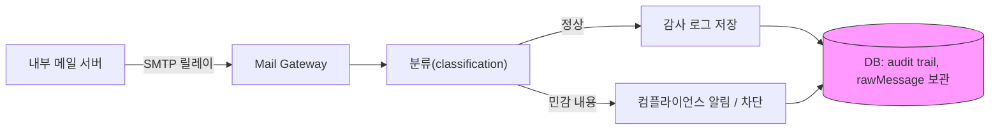
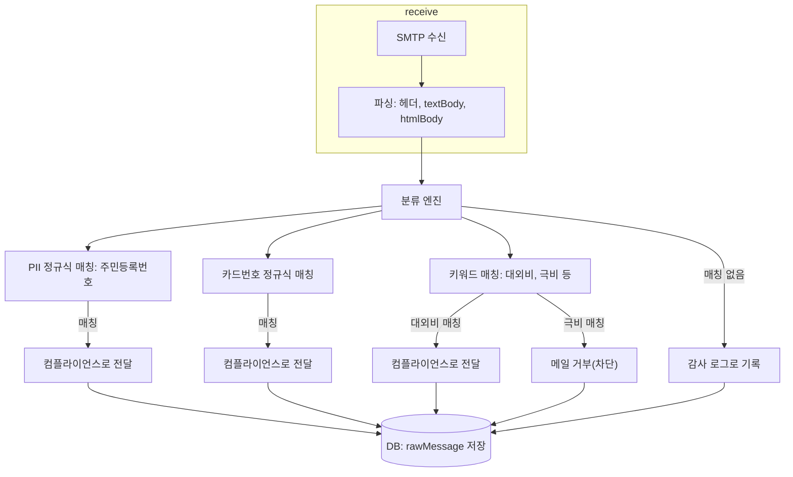

# 내부 메일 감사 및 컴플라이언스

## 개요
내부 메일 서버는 모든 아웃바운드 메일을 감사 로깅을 위해 Mail Gateway를 통해 라우팅합니다. 게이트웨이는 수신된 원문을 rawMessage로 저장합니다. rawMessage는 각 이메일의 전체 RFC822 원문을 의미합니다. 게이트웨이는 본문과 헤더를 분석해 개인정보(PII) 패턴과 기밀 키워드를 분류합니다. 분류 결과가 민감한 내용으로 판단되면 컴플라이언스 팀에 알림을 보내거나 메일을 차단합니다. 모든 메일은 향후 감사를 위해 DB에 보존됩니다.

## 아키텍처


## 감사 처리 흐름


## 환경변수 설정
예시 .env 파일:

```
# 데이터베이스 (SQLite)
DATABASE_URL=file:./data/mail-gateway.db

# SMTP 수신 설정
SMTP_HOST=0.0.0.0
SMTP_PORT=2525

# 내부 메일 서버 IP만 허용
SMTP_ALLOWED_IPS=10.0.0.5

# 컴플라이언스 팀으로 전달할 릴레이 SMTP
RELAY_SMTP_HOST=smtp-compliance.internal.company
RELAY_SMTP_PORT=587
RELAY_SMTP_USER=relay-user
RELAY_SMTP_PASS=relay-pass

# 로깅 및 성능
LOG_LEVEL=info
MAX_MESSAGE_SIZE_MB=50

# 속도 제한
RATE_LIMIT_MAX=100
RATE_LIMIT_WINDOW_MS=60000
```

## 룰 설정
다음은 컴플라이언스 중심의 룰들입니다. 각 룰을 CLI로 추가하는 예시를 보여줍니다.

1) 주민등록번호 패턴 탐지

```bash
npm run cli -- create "ssn-detect" \
  --action forward \
  --forward-to compliance@company.com \
  --priority 1000 \
  --category pii-detected \
  --conditions '[{"field":"body","operator":"regex","value":"\\d{6}-[1-4]\\d{6}"}]'
```

2) 카드번호 패턴 탐지

```bash
npm run cli -- create "card-detect" \
  --action forward \
  --forward-to compliance@company.com \
  --priority 900 \
  --category card-detected \
  --conditions '[{"field":"body","operator":"regex","value":"\\d{4}[-\\s]?\\d{4}[-\\s]?\\d{4}[-\\s]?\\d{4}"}]'
```

3) 기밀 키워드 탐지 (대외비)

```bash
npm run cli -- create "confidential-keyword" \
  --action forward \
  --forward-to compliance@company.com \
  --priority 800 \
  --category confidential \
  --conditions '[{"field":"body","operator":"contains","value":"대외비"}]'
```

4) 기밀 차단 (극비)

```bash
npm run cli -- create "secret-block" \
  --action reject \
  --priority 950 \
  --category blocked \
  --conditions '[{"field":"body","operator":"contains","value":"극비"}]'
```

5) 일반 감사 로그 (catch-all)

```bash
npm run cli -- create "audit-log" \
  --action log \
  --priority 1 \
  --category audit-log \
  --conditions '[{"field":"body","operator":"regex","value":".*"}]'
```

각 룰의 정규식은 `new RegExp(pattern, 'i')`로 처리됩니다 (대소문자 무시). 유효하지 않은 정규식은 경고 로그를 남기고 해당 조건은 false로 처리됩니다.

## 감사 데이터 조회
감사 데이터를 조회하는 방법 예시:

- 대시보드: /emails 페이지에서 상태, 날짜 등으로 검색

- API: 분류된 메일 목록 조회

```
GET /api/emails?status=classified
```

- 특정 메일의 전체 상세 및 rawMessage 확인

```
GET /api/emails/:id
```

- 컴플라이언스 전달 로그 확인

```
GET /api/forward-logs?status=success
```

rawMessage 필드는 각 이메일의 전체 RFC822 원문을 포함하므로, 상세 조회 시 원문을 반환합니다.

## 주의사항
- rawMessage는 전체 RFC822 원문을 DB에 저장하므로 디스크 사용량을 주의해야 합니다.
- 정규식 패턴이 복잡할수록 처리 성능에 영향을 줍니다. 배치 테스트로 성능을 확인하세요.
- 유효하지 않은 정규식은 경고 로그를 남기고 해당 조건은 false로 처리됩니다.
- 모든 조건은 기본적으로 AND 매칭입니다. 복수 패턴을 독립적으로 탐지하려면 룰을 분리하세요.
- reject 액션은 현재 구현에서 archived 상태로 저장되며, SMTP 거부 응답을 반환합니다.
- 개인정보보호법(PIPA) 및 관련 규정 준수를 위해 DB 접근 권한과 보존 기간 정책을 반드시 관리하세요.
- 룰의 priority 값이 높을수록 먼저 평가됩니다.

## 관련 문서
- [README](../../README.md)
- [OpenAPI 스펙](../../docs/openapi.yaml)
