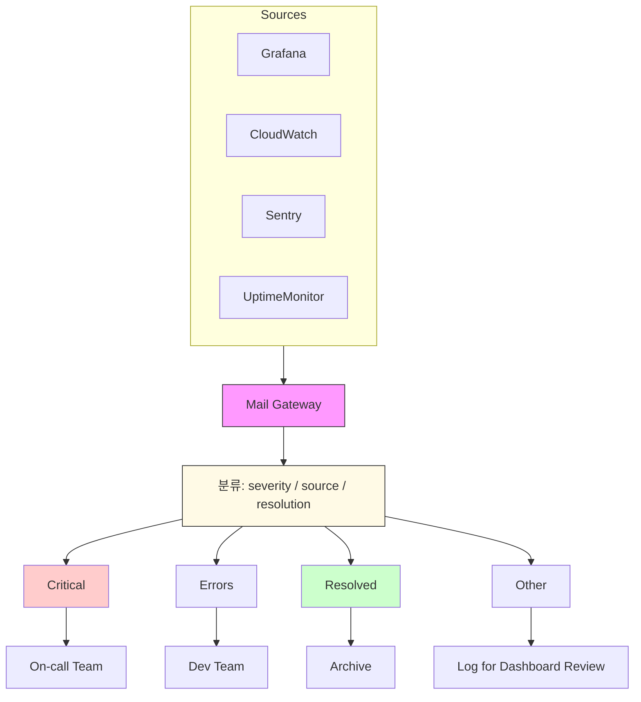

# 모니터링 알림 집약

## 개요

여러 모니터링 도구들(Grafana, CloudWatch, Sentry, Uptime 모니터, cron job 알림 등)이 모두 이메일 알림을 전송할 때, 각 도구마다 별도의 배포 리스트를 관리하지 않고 중앙의 Mail Gateway로 모아 처리합니다. Mail Gateway는 수신된 알림을 심각도(severity), 출처(source), 해결 상태(resolution status)로 분류한 뒤, 적절한 온콜 팀으로 전달하거나 해결된 알림은 보관(archive)합니다. 이 방식은 알림 중복을 줄이고, 온콜 팀으로의 정확한 라우팅과 대시보드 기반 가시성을 제공합니다.

## 아키텍처



## 알림 분류 흐름

```mermaid
graph TB
  A[수신된 알림 메일] --> B[파싱: subject / from / body]
  B --> C[룰 매칭]
  C --> R1{subject에 'CRITICAL' 포함?}
  C --> R2{from이 '@sentry.io'로 끝나나?}
  C --> R3{subject가 '[RESOLVED]' 또는 '[OK]'로 시작하나?}
  R1 -->|예| F1[온콜팀으로 전달]
  R2 -->|예| F2[개발팀 오류함으로 전달]
  R3 -->|예| F3[보관(Archive)]
  C --> R4{from에 'cloudwatch' 포함?}
  R4 -->|예| F4[인프라팀으로 전달]
  C --> F5[기타: 로깅 및 대시보드]

  style A fill:#eef
  style B fill:#fff4cc
  style F1 fill:#ffdddd
  style F3 fill:#ddffdd
```

## 환경변수 설정

다음은 .env 예시입니다. 주요 포인트는 SMTP_ALLOWED_IPS에 모든 모니터링 도구의 발신 IP를 등록하고, 모니터링 도구의 버스트 트래픽에 대비해 RATE_LIMIT_MAX를 충분히 높게 설정하는 것입니다.

```
# 데이터베이스 (SQLite)
DATABASE_URL=file:./data/mail-gateway.db

# SMTP 수신 설정
SMTP_HOST=0.0.0.0
SMTP_PORT=2525

# 모니터링 도구 발신 IP 허용
SMTP_ALLOWED_IPS=10.0.0.0/8,192.168.1.10,203.0.113.45

# Relay (온콜 팀으로 전달할 SMTP)
RELAY_SMTP_HOST=smtp.relay.company.com
RELAY_SMTP_PORT=587
RELAY_SMTP_USER=relay-user
RELAY_SMTP_PASS=relay-pass

# 속도 제한 (알림 버스트 대비)
RATE_LIMIT_MAX=500
RATE_LIMIT_WINDOW_MS=60000

# 로깅
LOG_LEVEL=info

# 메시지 크기 제한
MAX_MESSAGE_SIZE_MB=25
```

## 룰 설정

각 룰은 CLI를 통해 생성합니다. OR 조건을 지원하지 않으므로 유사 패턴은 각각 별도의 룰로 만듭니다.

1) CRITICAL 알림: subject에 'CRITICAL'이 포함된 경우

```bash
npm run cli -- create "rule-critical" \
  --action forward \
  --forward-to oncall@company.com \
  --priority 1000 \
  --category critical \
  --conditions '[{"field":"subject","operator":"contains","value":"CRITICAL"}]'
```

별도로 P1 태그용 룰 (OR 미지원이므로 별도 생성)

```bash
npm run cli -- create "rule-p1" \
  --action forward \
  --forward-to oncall@company.com \
  --priority 1000 \
  --category critical \
  --conditions '[{"field":"subject","operator":"contains","value":"P1"}]'
```

2) Sentry 에러: 발신자가 '@sentry.io'로 끝나는 경우

```bash
npm run cli -- create "rule-sentry" \
  --action forward \
  --forward-to dev-errors@company.com \
  --priority 500 \
  --category sentry-error \
  --conditions '[{"field":"from","operator":"endsWith","value":"@sentry.io"}]'
```

3) 해결 완료: subject가 '[RESOLVED]'로 시작하는 경우 → 보관

```bash
npm run cli -- create "rule-resolved-res" \
  --action archive \
  --priority 900 \
  --category resolved \
  --conditions '[{"field":"subject","operator":"startsWith","value":"[RESOLVED]"}]'
```

subject가 '[OK]'로 시작하는 경우 → 보관 (별도 룰)

```bash
npm run cli -- create "rule-resolved-ok" \
  --action archive \
  --priority 900 \
  --category resolved \
  --conditions '[{"field":"subject","operator":"startsWith","value":"[OK]"}]'
```

4) CloudWatch 알림: 발신자에 'cloudwatch' 문자열이 포함된 경우

```bash
npm run cli -- create "rule-cloudwatch" \
  --action forward \
  --forward-to infra@company.com \
  --priority 400 \
  --category aws-alert \
  --conditions '[{"field":"from","operator":"contains","value":"cloudwatch"}]'
```

5) 기타 알림: 캐치올 (낮은 우선순위)

```bash
npm run cli -- create "rule-misc" \
  --action log \
  --priority 1 \
  --category misc-alert \
  --conditions '[{"field":"subject","operator":"regex","value":".*"}]'
```

설명: archive 액션은 전달 없이 보관만 하므로 `--forward-to`가 필요 없습니다. catch-all은 `regex`와 `.*` 패턴으로 모든 메일에 매칭됩니다.

## 대시보드 활용

- 통계 페이지 (/)
  - 오늘 수신된 전체 알림 수
  - 상태별 분포 (received, classified, forwarded, failed, archived)
- 카테고리 필터
  - category별 필터링으로 critical, resolved, sentry-error, aws-alert, misc-alert 구분
- 전달 확인
  - 온콜팀에게 전달된 알림의 로그(송신 기록)를 포워드 로그에서 확인해 실제로 전달되었는지 검증

대시보드는 알림 트렌드와 폭주 상황을 빠르게 파악하는 데 유용합니다. 특히 critical 비율과 resolved 비율을 같이 보면 대응 속도를 판단할 수 있습니다.

## 주의사항

- 반드시 모니터링 도구의 발신 IP를 모두 SMTP_ALLOWED_IPS에 등록해야 합니다. 등록하지 않으면 메일이 수신 거부됩니다.
- 대량 알림 발생 시 RATE_LIMIT_MAX를 충분히 높게 설정하세요. 기본값(100)이 낮으면 정상 알림이 누락될 수 있습니다.
- 시스템은 OR 조건을 지원하지 않으므로, 유사 패턴은 별도의 룰로 분리해야 합니다. 예를 들어 'CRITICAL'과 'P1'은 각각 다른 룰로 만들어야 합니다.
- contains 연산자는 대소문자 무시로 동작합니다. 따라서 'critical'과 'CRITICAL'은 동일하게 매칭됩니다.
- 알림 폭풍(alert storm) 시에도 모든 메일이 데이터베이스에 저장됩니다. 디스크 용량을 모니터링하고 보관 정책을 설정하세요.
- 룰의 priority 값이 높을수록 먼저 평가됩니다.

## 관련 문서

- [README](../../README.md)
- [OpenAPI 스펙](../../docs/openapi.yaml)
