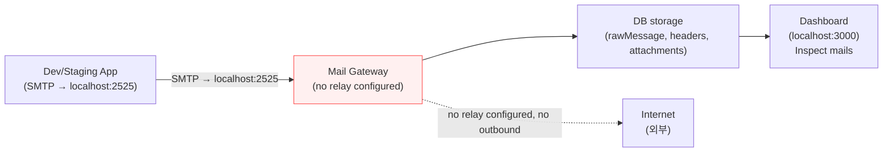
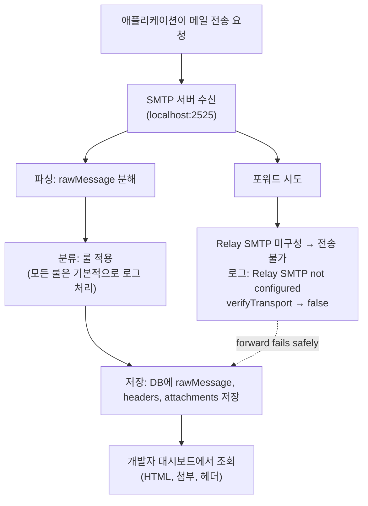

# 개발/스테이징 메일 캡처

## 개요

개발 및 스테이징 환경에서 애플리케이션은 회원가입 확인, 비밀번호 재설정, 알림 등 다양한 목적으로 메일을 전송합니다. 이 메일들은 실제 사용자에게 도달해서는 절대 안 됩니다. Mail Gateway는 메일 트랩 역할을 하여 모든 발송된 메일을 데이터베이스에 캡처하고, 대시보드를 통해 내용을 확인할 수 있도록 합니다. 릴레이 SMTP는 구성하지 않아 시스템 외부로 메일이 나가지 않습니다. 개발자는 대시보드에서 메일 본문, HTML 렌더링, 첨부파일, 헤더를 검사할 수 있습니다.

## 아키텍처



아키텍처에서 중요한 점은 릴레이가 구성되지 않았기 때문에 어떤 메일도 외부로 전송되지 않는다는 점입니다. 모든 메시지는 내부 DB에 저장되어 대시보드를 통해서만 접근할 수 있습니다.

## 메일 캡처 흐름



포워드 액션은 RELAY_SMTP_HOST가 비어 있으면 항상 실패하도록 안전하게 설계되어 있습니다. 포워드 시도는 경고 로그를 남기고 실제 외부 발송을 하지 않습니다.

## 환경변수 설정

아래는 개발/스테이징용 예시 .env 파일입니다.

```
# 릴레이 SMTP를 비워두면 모든 forward 액션이 실패하여 외부 발송이 차단됩니다
RELAY_SMTP_HOST=
RELAY_SMTP_PORT=587
RELAY_SMTP_USER=
RELAY_SMTP_PASS=

# 개발 환경에서는 넓은 IP 대역 허용
SMTP_ALLOWED_IPS=127.0.0.1,172.16.0.0/12,192.168.0.0/16,10.0.0.0/8

# SMTP 수신 설정
SMTP_HOST=0.0.0.0
SMTP_PORT=2525

# 데이터베이스 (SQLite)
DATABASE_URL=file:./data/mail-gateway.db

# 디버깅을 위해 로그 레벨을 debug로 설정
LOG_LEVEL=debug

# 메시지 크기 제한
MAX_MESSAGE_SIZE_MB=25
```

중요: RELAY_SMTP_HOST를 비워두면 포워더는 "Relay SMTP not configured, forwarding disabled"라는 경고를 로깅하며 verifyTransport는 false를 반환합니다. 포워드 시도는 "Relay SMTP host is not configured" 예외를 던집니다.

## 애플리케이션 SMTP 설정

일반적인 프레임워크에서 Mail Gateway로 SMTP를 포인팅하는 예시입니다.

- Node.js (nodemailer):

```js
const transporter = nodemailer.createTransport({ host: 'localhost', port: 2525, secure: false });
```

- Python (smtplib):

```py
import smtplib
smtp = smtplib.SMTP('localhost', 2525)
```

- Django (settings.py):

```py
EMAIL_HOST = 'localhost'
EMAIL_PORT = 2525
```

- Spring Boot (application.properties):

```
spring.mail.host=localhost
spring.mail.port=2525
```

- Docker Compose: 앱과 게이트웨이가 같은 네트워크에 있으면 localhost 대신 서비스 이름 mail-gateway 사용

## 룰 설정 (선택)

메일 트랩에서는 룰이 필수는 아니지만, 필터링과 분류를 위해 유용합니다. CLI로 룰을 추가하는 예시를 보여줍니다.

1) 모든 메일 로그 (catch-all, 우선순위 1)

```bash
npm run cli -- create "catch-all" \
  --action log \
  --priority 1 \
  --category catch-all \
  --conditions '[{"field":"subject","operator":"regex","value":".*"}]'
```

2) 특정 패턴 확인용: 제목에 'verification' 포함

```bash
npm run cli -- create "auth-verification" \
  --action log \
  --priority 5 \
  --category auth-verification \
  --conditions '[{"field":"subject","operator":"contains","value":"verification"}]'
```

기본 동작은 룰이 없어도 모든 메일을 로그로 남기는 것입니다. 위 예시는 필터링과 대시보드 분류에 도움됩니다.

## 대시보드 활용

주요 기능:

- /emails: 최근 수신 메일 목록, 제목과 발신자 확인
- /emails/:id: HTML 본문 미리보기, 첨부파일 다운로드, 전체 헤더 조회
- rawMessage로 실제 RFC822 원문 확인 가능
- 상태 필터로 분류 결과 확인 (예: auth-verification, catch-all 등)

대시보드는 React 19와 Vite로 작성되어 있으며, API 서버(포트 3000)에서 제공됩니다. 로컬 개발 시 http://localhost:3000 으로 접속하여 검사합니다.

## Docker Compose 구성

아래는 앱 서비스와 mail-gateway가 같은 네트워크에 있는 간단한 docker-compose.yml 스니펫입니다.

```yaml
services:
  my-app:
    # ... your app config
    environment:
      - SMTP_HOST=mail-gateway
      - SMTP_PORT=2525
    depends_on:
      - mail-gateway
  mail-gateway:
    build: ./mail-gateway
    ports:
      - '2525:2525'
    environment:
      - SMTP_ALLOWED_IPS=0.0.0.0/0
      - DATABASE_URL=file:/app/data/mail-gateway.db
      # RELAY_SMTP_HOST intentionally empty
  mail-gateway-api:
    build:
      context: ./mail-gateway
      dockerfile: Dockerfile.api
    ports:
      - '3000:3000'
    environment:
      - DATABASE_URL=file:/app/data/mail-gateway.db
```

실제 배포가 아닌 개발용 구성이므로 SMTP_ALLOWED_IPS를 0.0.0.0/0으로 열어두는 것은 편의상 허용하지만, 절대 프로덕션에서 사용하지 마십시오.

## 주의사항

- RELAY_SMTP_HOST를 실수로 설정하면 실제 사용자에게 메일이 발송될 수 있습니다. 반드시 비워두십시오.
- SMTP_ALLOWED_IPS를 0.0.0.0/0으로 설정하면 모든 IP에서 접근 가능해집니다. 개발 환경에서만 사용하세요.
- 대량 테스트를 반복하면 SQLite DB 파일이 커질 수 있습니다. data/ 디렉토리를 주기적으로 정리하세요.
- rawMessage는 메일의 전체 RFC822 원문을 저장하므로, 첨부파일이 클 경우 디스크 사용량이 급증할 수 있습니다.
- 이 설정은 프로덕션 환경에서 절대 사용하지 마십시오.

## 관련 문서

- [README](../../README.md)
- [OpenAPI 스펙](../../docs/openapi.yaml)
