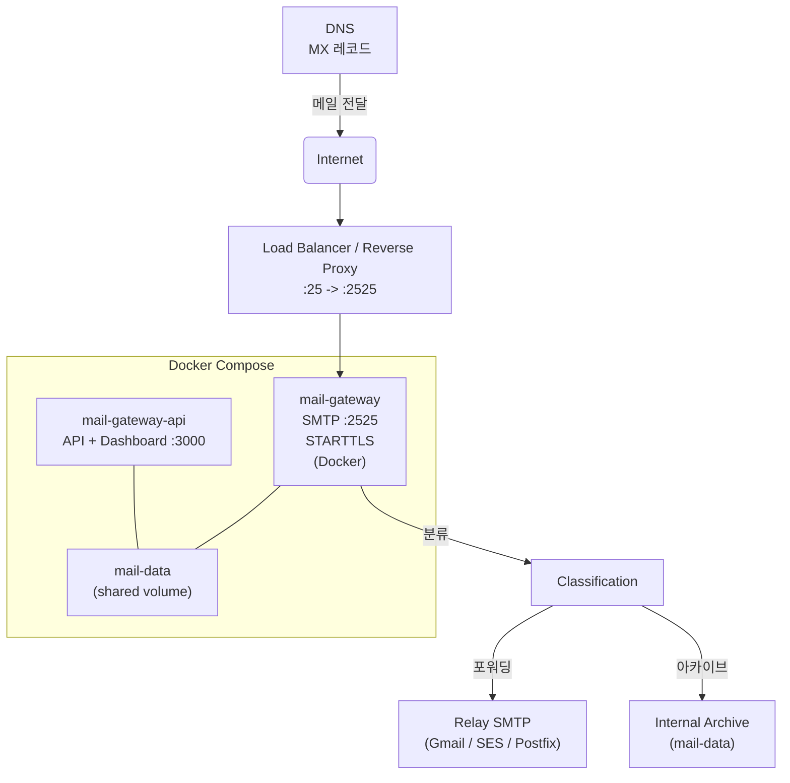
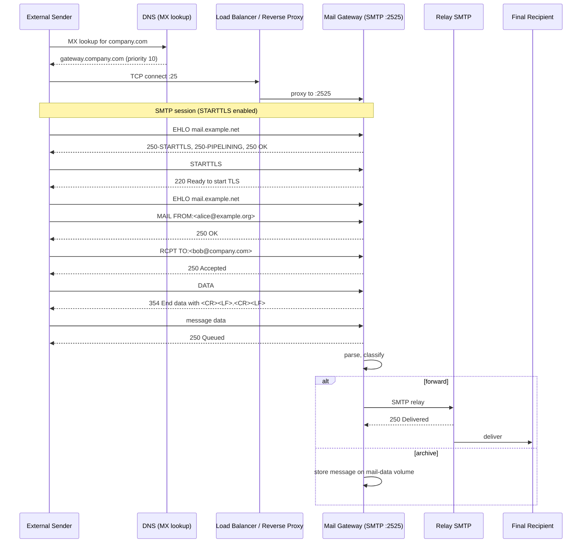

# MX 레코드 기반 프로덕션 메일 수신

## 개요

도메인의 MX 레코드를 Mail Gateway 서버로 설정하여 외부 발신자의 메일을 수신하는 프로덕션 구성입니다. 외부에서 발송된 메일은 표준 SMTP 포트 25를 통해 도달하고, 퍼블릭 리버스 프록시나 로드 밸런서가 포트 25를 받아 내부의 Mail Gateway로 포트 2525로 전달합니다. Mail Gateway는 수신한 SMTP 연결에서 STARTTLS로 전송 암호화를 사용하도록 구성되어 있으며, 메시지를 수신, 파싱, 분류(classification)한 뒤 내부 수신자에게 전달하거나 아카이브(보관)로 보냅니다.

배포는 Docker Compose를 사용합니다. Mail Gateway 컨테이너는 SMTP 수신(포트 2525), mail-gateway-api 컨테이너는 API와 대시보드(포트 3000)를 제공하며 두 컨테이너는 공유 볼륨(mail-data)을 사용합니다.

## 아키텍처



## 인프라 구성 흐름



## DNS 설정

예시 DNS 레코드:

```
; MX 레코드
company.com.    IN  MX  10  gateway.company.com.

; A 레코드 (Gateway 서버)
gateway.company.com.  IN  A  203.0.113.10
```

설명: MX 우선순위 값은 낮을수록 우선입니다. 게이트웨이 서버는 퍼블릭 IP를 가져야 하거나 프록시/로드밸런서 뒤에 있어야 합니다. 여러 MX 레코드를 사용해 가용성을 높일 수 있지만, 각 서버는 포트 25를 수신할 수 있어야 합니다.

## 리버스 프록시 설정

리버스 프록시(nginx stream)를 사용해 외부 포트 25를 내부 포트 2525로 전달하는 예시 구성:

```nginx
stream {
    upstream mail_gateway {
        server 127.0.0.1:2525;
    }
    server {
        listen 25;
        proxy_pass mail_gateway;
        proxy_timeout 300s;
    }
}
```

설명: 포트 25는 루트 권한이 필요한 특권 포트이므로 컨테이너 내부에서 직접 바인드하는 대신 호스트의 리버스 프록시가 25를 받아서 2525로 전달합니다. 대안으로 iptables/nftables 포트 포워딩도 사용 가능합니다.

## TLS 인증서 설정

1. 프로덕션: Let's Encrypt 사용을 권장합니다. certbot을 사용해 도메인 인증서를 발급하고 자동 갱신을 설정하세요.
2. 발급된 인증서 경로를 Mail Gateway 설정에 맞게 지정합니다.
3. 필요한 환경변수 예시:

```
SMTP_TLS_ENABLED=true
SMTP_TLS_KEY=/app/certs/privkey.pem
SMTP_TLS_CERT=/app/certs/fullchain.pem
```

4. Docker에서 인증서를 읽도록 볼륨을 마운트합니다:

```
volumes:
  - ./certs:/app/certs:ro
```

참고: 키/인증서 파일이 없으면 SMTP 서버가 STARTTLS를 제공하지 못하고 일부 연결에서 실패할 수 있습니다.

## 환경변수 설정

프로덕션용 .env 예시:

```
# 데이터베이스 (SQLite 기본)
DATABASE_URL=file:./data/mail-gateway.db

# SMTP 수신 설정
SMTP_HOST=0.0.0.0
SMTP_PORT=2525
SMTP_ALLOWED_IPS=0.0.0.0/0

# 포워딩용 릴레이 SMTP 설정 (Gmail, SES, 내부 Postfix 등)
RELAY_SMTP_HOST=smtp-relay.example.net
RELAY_SMTP_PORT=587
RELAY_SMTP_USER=relay-user
RELAY_SMTP_PASS=supersecret

# TLS
SMTP_TLS_ENABLED=true
SMTP_TLS_KEY=/app/certs/privkey.pem
SMTP_TLS_CERT=/app/certs/fullchain.pem

# 성능 및 로깅
RATE_LIMIT_MAX=200
RATE_LIMIT_WINDOW_MS=60000
LOG_LEVEL=info
MAX_MESSAGE_SIZE_MB=25
```

설명: SMTP_ALLOWED_IPS를 0.0.0.0/0으로 설정하면 모든 IP에서 연결을 수락합니다. 로드 밸런서가 필터링을 담당한다면 괜찮지만, 직접 노출된 경우에는 허용 대역을 제한하세요. STARTTLS 관련 파일 경로는 컨테이너 내 경로와 일치해야 합니다.

## Docker Compose 구성

아래는 production용 docker-compose.yml 예시입니다.

```yaml
version: '3.8'
services:
  mail-gateway:
    image: yourorg/mail-gateway:latest
    restart: always
    ports:
      - "2525:2525"
    environment:
      - SMTP_HOST=0.0.0.0
      - SMTP_PORT=2525
      - SMTP_TLS_ENABLED=true
      - SMTP_TLS_KEY=/app/certs/privkey.pem
      - SMTP_TLS_CERT=/app/certs/fullchain.pem
      - DATABASE_URL=${DATABASE_URL}
      - RELAY_SMTP_HOST=${RELAY_SMTP_HOST}
      - RELAY_SMTP_PORT=${RELAY_SMTP_PORT}
      - RELAY_SMTP_USER=${RELAY_SMTP_USER}
      - RELAY_SMTP_PASS=${RELAY_SMTP_PASS}
      - SMTP_ALLOWED_IPS=${SMTP_ALLOWED_IPS}
      - RATE_LIMIT_MAX=${RATE_LIMIT_MAX}
      - RATE_LIMIT_WINDOW_MS=${RATE_LIMIT_WINDOW_MS}
      - LOG_LEVEL=${LOG_LEVEL}
      - MAX_MESSAGE_SIZE_MB=${MAX_MESSAGE_SIZE_MB}
    volumes:
      - mail-data:/app/data
      - ./certs:/app/certs:ro

  mail-gateway-api:
    image: yourorg/mail-gateway-api:latest
    restart: always
    ports:
      - "3000:3000"
    environment:
      - DATABASE_URL=${DATABASE_URL}
      - LOG_LEVEL=${LOG_LEVEL}
    volumes:
      - mail-data:/app/data

volumes:
  mail-data:
    name: mail-data
```

설명: mail-data 볼륨은 메시지 아카이브와 메타데이터를 저장합니다. Dockerfile에는 HEALTHCHECK가 포함되어 있어 컨테이너 상태를 확인합니다.

## 룰 설정 예시

프로덕션에서 사용할 수 있는 몇 가지 룰 예시입니다.

1) 스팸 차단: 제목이 [SPAM]으로 시작하면 거부

```bash
npm run cli -- create "reject-spam-subject" \
  --action reject \
  --priority 1000 \
  --category spam \
  --conditions '[{"field":"subject","operator":"regex","value":"^\\[SPAM\\]"}]'
```

2) 업무 메일: 제목에 '견적'이 포함되면 sales@company.com으로 전달

```bash
npm run cli -- create "route-quote-to-sales" \
  --action forward \
  --forward-to sales@company.com \
  --priority 100 \
  --category sales \
  --conditions '[{"field":"subject","operator":"contains","value":"견적"}]'
```

3) 기본 수신: 캐치올, 모든 다른 메시지는 inbox@company.com으로 전달

```bash
npm run cli -- create "catch-all" \
  --action forward \
  --forward-to inbox@company.com \
  --priority 1 \
  --category default \
  --conditions '[{"field":"subject","operator":"regex","value":".*"}]'
```

설명: 우선순위 숫자가 높을수록 먼저 평가됩니다. 룰은 명확히 정의되어야 하며, 기본 동작은 명시적으로 캐치올로 설정하세요.

## 모니터링

- 대시보드: mail-gateway-api의 /stats 엔드포인트에서 일일 수신량, 분류 통계, 실패한 전달 등을 확인하세요.
- Docker healthcheck: 컨테이너에 내장된 HEALTHCHECK를 사용해 서비스 상태를 모니터링하고 재시작 정책을 설정하세요.
- 로그: SMTP 세션 로그와 전달 로그를 중앙 로깅(예: ELK, Loki)으로 전송해 전달 실패를 추적하세요.
- 로그 레벨: 문제가 발생하면 LOG_LEVEL을 debug로 높여 상세 정보를 확인하세요. 평상시엔 info 권장.

## 주의사항

- 포트 25는 많은 클라우드 제공자(AWS, GCP, Azure)에서 기본 차단되어 있습니다. 퍼블릭 수신을 위해선 차단 해제 요청이나 외부 로드밸런서 사용이 필요합니다.
- SMTP_ALLOWED_IPS를 0.0.0.0/0으로 설정하면 모든 발신자에서 연결을 허용합니다. Mail Gateway는 기본적으로 수신 전용이며, 룰에 의해 지정된 경우에만 릴레이 동작을 수행합니다. 잘못 구성하면 오픈 릴레이가 될 위험이 있습니다.
- STARTTLS는 필수입니다. 프로덕션에서 평문 SMTP는 보안상 위험합니다.
- SQLite는 단일 인스턴스, 낮은 트래픽 환경에 적합합니다. 다중 인스턴스나 고가용성이 필요하면 PostgreSQL을 사용하세요.
- 공인 인증서(Let's Encrypt) 사용 시 자동 갱신을 설정하세요 (certbot --renew).
- 현재 DKIM/SPF 검증 또는 서명은 미구현입니다. 스팸 필터링에 한계가 있으니 다른 수단과 병행하세요.
- 메일 전달 실패 시 재시도 메커니즘이 미구현입니다. 중요한 메일의 경우 전달 로그를 모니터링하세요.

## 관련 문서

- [README](../../README.md)
- [OpenAPI 스펙](../../docs/openapi.yaml)
